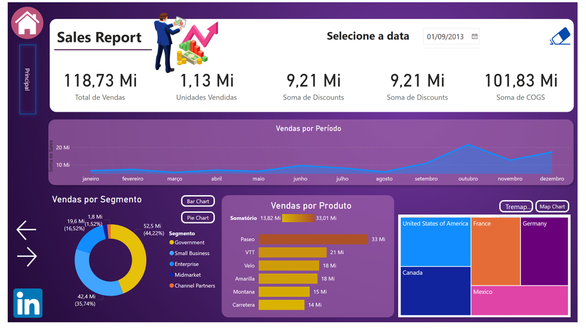
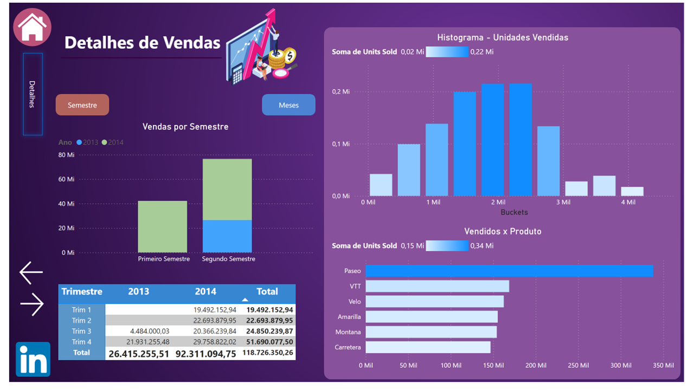
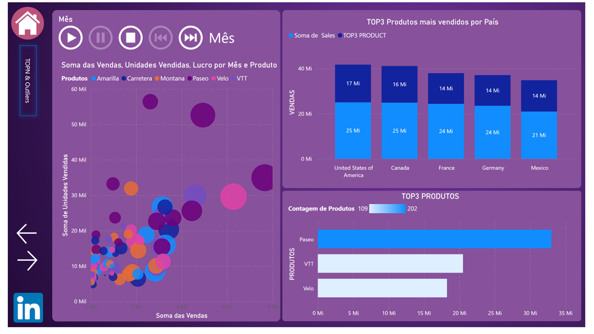
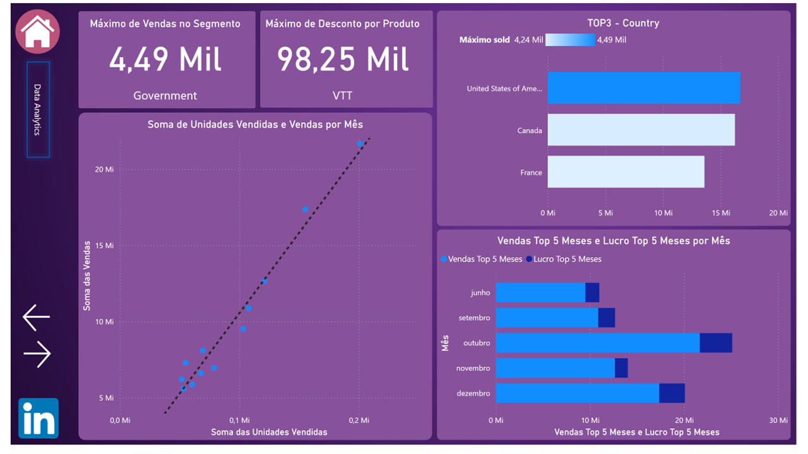
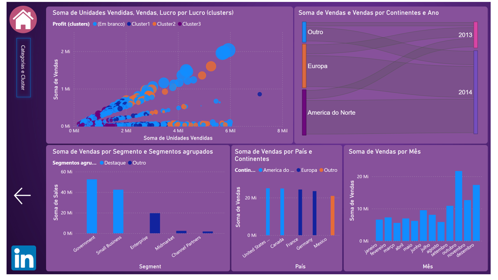

# 📊 Sales Report - Desafio de Projeto Data Analytics

Este repositório contém o desenvolvimento de um Dashboard de Vendas interativo no Power BI, focado na análise de performance de produtos, vendas globais e métricas de lucratividade. O projeto foi estruturado para fornecer insights rápidos para a tomada de decisão gerencial.

## 🛠️ Tecnologias e Ferramentas

  * **Power BI:** Criação de visualizações e dashboards.
  * **DAX (Data Analysis Expressions):** Criação de medidas calculadas.
  * **Power Query:** Limpeza e transformação de dados (ETL).

## 🖼️ Visualização do Projeto

